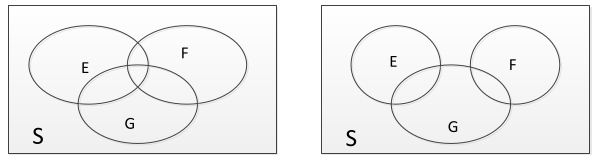
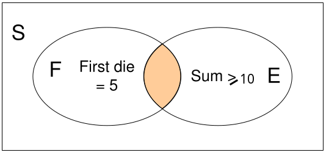
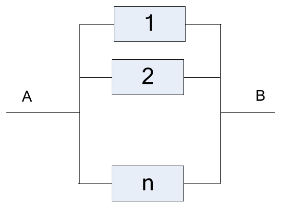
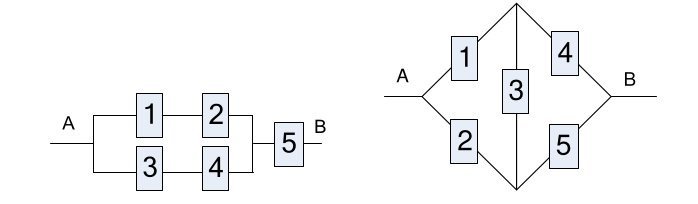

# 1. Index

- [1. Index](#1-index)
- [2. Introduction to Probability](#2-introduction-to-probability)
  - [2.1. Random Experiments](#21-random-experiments)
  - [2.2. Axioms of Probability](#22-axioms-of-probability)
    - [2.2.1. Example](#221-example)
  - [2.3. Uniform Probability Model](#23-uniform-probability-model)
    - [2.3.1. Basic Principle of Counting](#231-basic-principle-of-counting)
      - [2.3.1.1. Example: Extracting Balls](#2311-example-extracting-balls)
    - [2.3.2. Example: Books](#232-example-books)
  - [2.4. Binomial Coefficient](#24-binomial-coefficient)
    - [2.4.1. Example: Boys and Girls](#241-example-boys-and-girls)
    - [2.4.2. Example: Ordering People](#242-example-ordering-people)
    - [2.4.3. Example: Basketball](#243-example-basketball)
  - [2.5. Conditional Probability](#25-conditional-probability)
  - [2.6. Law of Total Probability](#26-law-of-total-probability)
    - [2.6.1. Example: Drivers and Accidents](#261-example-drivers-and-accidents)
  - [2.7. Bayes' Theorem](#27-bayes-theorem)
    - [2.7.1. Example: Lab Tests](#271-example-lab-tests)
  - [2.8. Independence of Events](#28-independence-of-events)
    - [2.8.1. Repeated Trials](#281-repeated-trials)
      - [2.8.1.1. Exercise: Coin Tossing](#2811-exercise-coin-tossing)
      - [2.8.1.2. Example: Keys and Doors](#2812-example-keys-and-doors)
  - [2.9. Parallel Systems](#29-parallel-systems)
    - [2.9.1. Example: Harder Systems](#291-example-harder-systems)

# 2. Introduction to Probability

The definition of Probability has been discussed for long.

For us, we will define it as a **relative frequency**. Given $N$ independent
conditions, and $k$ tries of an Event $E$, the probability is defined as:

$$
P(E) = \lim_{N\to+\infty}{k \over N}
$$

Solving an infinite limits is bothersome, so we will use some tricks like
_symmetry_ to simplify many calculations.

## 2.1. Random Experiments

Some examples of random experiments are:

- Throw of 6-face dices

- A horse race

- Integrity test of a Device

When performing an experiment, **we** decide a _desired outcome_
(certain number on top of the dice, horse order at arrival, times the device fails)

Once we decided the outcome, the next step is to understand the **Sample Space Set**.

On our example:

$$
\begin{matrix}
  S_1 = \Set{1,2,3,4,5,6} \\[0.5em]
  S_2 = \Set{\text{permutation of 1..7}}\\[0.5em]
  S_3 = [0, +\infty)
\end{matrix}
$$

After defining the sample space, an event is defined as a **set of possible
outcome of the Sample Space**: &emsp;$E \subseteq S$

Some special events are:

- **Null Event**: $\empty$

- **Certain Event**: $S$

Since events are sets, we can use _Set Algebra_ to manipulate them:

- **Union** $(\cup)$: The union of two Events $E \cup F$ are the events
  that appear either on $E$ or $F$ (or both)

- **Intersection** $(\cap)$: The intersection of two Events $E \cap F = EF$
  are the events that appear in both $E$ and $F$

- **Complement** $(E^C)$: The complement of an Event $E$ is the event $F$ that
  produces a _Null Set_ when intersected $E^C \cap E = \empty$

These three algebraic relations are related by _De Morgan's Law_:

$$
(A \cup B)^C = A^C \cap B^C \\
(A \cup B)^C = A^C \cup B^C \\
$$

Let $E, F, G$ be three arbitrary events on the space $S$, as shown in the
picture on the right.

We can describe _set algebra equations_ to describe the following arguments:

1. Only $E$ occurs: &emsp; $E \cap (F \cup G)^C = EF^CG^C$

2. Both $E$ and $G$, but not $F$: &emsp; $E \cap G \cap F^C = EGF^C$

3. At least one of the events: &emsp; $E \cup F \cup G$

4. At least two of the events: &emsp; $(EG \cup EF \cup FG)$

5. All three occurs: &emsp; $EFG$

6. None occur: &emsp; $(E \cup F \cup G)^C$

7. At most one occur: &emsp; $(EG \cup EF \cup GF)^C$

8. Exactly two: &emsp; $(EG \cup EF \cup FG) \cap (EFG)^C$

9. At most three: &emsp; $S$

Notice that the results we found are valid for every possible configuration of
the three sets.

<figure class="90">

<figcaption>

Two possible sets configurations.

</figcaption>
</figure>

## 2.2. Axioms of Probability

The axioms on which probability works on are:

1. $0 \le P(E) \le 1$

2. $P(S) = 1$

3. $E_i \vert E_iE_j = \empty \wedge i \ne j \Rightarrow P(\bigcup_i E_j) = \sum_i{P(E_i)}$

Starting from these three axioms, we can derive a couple of _useful properties_:

1. $P(E^C) = 1 - P(E)$

2. $P(E_1 \cup E_2) = P(E_1) + P(E_2) - P(E_1E_2)$

### 2.2.1. Example

Let's try to solve this problem:

> 28\% of the American males smoke cigarettes.
> 7\% smoke cigars.
> 5\% smoke both.
> What is the percentage of non-smokers?

Instead of trying to guess the correct answer, we try **modeling the problems in
terms of events**.

Calling $E$ the event "smokes cigarettes" and $F$ the event "smokes cigars", we
can tell that:

$$
\begin{matrix}
  P(E) = 0.28 \\
  P(F) = 0.07 \\
  P(EF) = 0.05
\end{matrix}
$$

The problems asks the quantity $P((E \cup F)^C)$:

$$
\begin{align*}
  P((E \cup F)^C) &= 1 - P(E \cup F) \\
  &= 1 - [P(E) + P(F) - P(EF)] \\
  &= 1 - 0.28 - 0.07 + 0.05 = 0.7
\end{align*}
$$

Thus, we can say with certainty that $70\%$ of Americans are non-smokers.

## 2.3. Uniform Probability Model

In many cases, the sample space of a random experiment has a **finite
cardinality** $(N = \vert S\vert)$.
Furthermore, the sample includes **equally likely outcomes**, like the throw of
fair dice or a fair coin.
From the axioms, we can derive that the probability of the occurance of an
event is exactly $p = \frac{1}{N}$

In these case, we are in a **Uniform Probability Model** (`UPM`).
In this case, the probability of an event $E$:

$$
P(E) = \frac{\vert E\vert}{\vert S\vert}
$$

### 2.3.1. Basic Principle of Counting

Given an experiment $C$ that is composed of two sub-experiments $C_1$ and $C_2$,
having respectively $N_1$ and $N_2$ possible outcomes, the number of possible
outcomes of experiments $C$ is equal to $N_1 \cdot N_2$.

More in general, with $k$ sub-experiments, the number of possible outcomes of
experiments $C$ is equal to:

$$
\prod_{i=1}^k{N_i}
$$

#### 2.3.1.1. Example: Extracting Balls

> Take an _opaque_ (can't see inside) urn with 6 black balls and 5 white balls.
> What is the probability that, extracting two **at random**
> (without replacing them), you get a black and a white one (whatever the order)?

The fact that we are doing the experiment at random, tells us that there are no
reason to think that extracting black balls or white balls should have more probability.

We can model this experiment by numbering the balls:

- **Black Balls**: $b_i \quad \wedge \quad i = 1, ..., 6$

- **White Balls**: $b_i \quad \wedge \quad i = 7, ..., 11$

We can model the sample space as:

$$
S = \Set{(b_i, b_j) \vert 1 \le i,j \le 11, i \ne j}
$$

To compute the cardinality of this set, we observe that the random experiment
is composed of two sub-experiments:

1. Extract a ball from a set of 11

2. Extract a ball from a set of 10

By the principle of counting, we have $11 \cdot 10 = 110$ possible outcomes,
each and every one equally likely, thus we are in a `UPM`.

Now, we need to define the event that interests us:

$$
\begin{align*}
E &= \Set{(b_i, b_j), 1 \le i \le 6, 7 \le j \le 11}
    \cup
    \Set{(b_i, b_j), 7 \le i \le 11, 1 \le j \le 6} \\
  &= E_1 \cup E_2
\end{align*}
$$

Each of the subsets has $6 \cdot 5 = 30$ elements.
Hence, $\vert E \vert = \vert E_1 \vert + \vert E_2 \vert = 60$

The probability of our desired outcome is:

$$
  P(E) = \frac{\vert E \vert}{\vert S \vert} = \frac{60}{110} = \frac{6}{11}
$$

### 2.3.2. Example: Books

> Suppose we have 10 books: 4 math books, 3 physics books, 2 informatics books
> and 1 chemistry book. If we pick them at random, which is the probability of
> ordering them lined up by subject.

The outcomes of this experiment are the permutations of the $n$ books,
calculable as $n!$.

The probability of the desired outcome is the valid ordering, we can choose
a fixed ordering like $(M, P, I, C)$, and calculate all the possible
permutations that satisfy the ordering, so: $4! \cdot 3! \cdot 2! \cdot 1!$.

At this point we can calculate the probability of the event $E$ by taking in
considerations all the possible ordering:

$$
P(E) = \frac{(4! \cdot 3! \cdot 2! \cdot 1!)\cdot 4!}{10!}
$$

## 2.4. Binomial Coefficient

Suppose we have a set of $n$ elements. From this set we extract a subset of
$k \le n$ elements.

The possible permutations of the $k$ elements are:

$$
s_k = \frac{n!}{(n-k)!}
$$

Instead, the number of possible subsets of $k$ elements, which doesn't account
for ordering inside the set, is given by the **Binomial Coefficient**:

$$
s_k = \frac{n!}{k!(n-k)!} = \binom{n}{k}
$$

Some useful properties of the binomial coefficient are:

- $\binom{n}{k} = 0 \Leftrightarrow k > n$

- $\binom{n}{k} = \binom{n}{n-k}$

- $\binom{n}{0} = 1$

- $\binom{n}{1} = \binom{n-1}{k-1} + \binom{n-1}{k}$

### 2.4.1. Example: Boys and Girls

> A group of 5 boys and 10 girls are lined up at random order.
>
> Calculate:
> a) The probability that the 4th person is a boy.
> b) The probability that the 12th person is a boy.
> c) The probability that Adam (a boy) is in 3rd position.

What we can say for sure is that, since the ordering is random, the
probability of a boy (or girl) to be in any $i$ position is the same.
Thus, question a) and b) are equivalent.

The outcomes we study for this problem are the permutations of the 15 people.

For the a) question our composite experiment is composed of two sub-experiments:

- Picking a boy and positioning him in the 4th (or 12th) position: $5 \cdot 1
= 5$
- Ordering the remaining 14 people: $14!$

Thus, the probability of the event is:

$$
  P(a) \frac{5 \cdot 14!}{15!} = \frac{5}{15} = \frac{\text{#boys}}{\text{#people}}
$$

The answer to question c) is similar, but we need to consider that Adam is a
specific boy.
Since we aren't picking one boy, but Adam in specific, the possible ordering
is just $1$.

$$
  P(c) = \frac{1 \cdot 14!}{15!} = \frac{1}{15}
$$

### 2.4.2. Example: Ordering People

> We have $n$ persons and we want to form a line with $k \le n$ of them at
> chosen random.
>
> Calculate the probability that:
> a) Adam is in the 1st position
> b) One person is in one position $j \le k$
> c) One person is IN the line

Since we are in a uniform probability model, we can calculate the probability
of a):

$$
P(a) = \frac{1 \cdot s_{k-1,n-1}}{s_{k,n}}
$$

Even before calculating $s_{i, l}$ we can already say that the probability of
a) and b) are the same, nonetheless, we can calculate the probability:

$$
\begin{CD}
  \begin{align*}
    s_{k,n} &= \frac{n!}{(n-k)!} \\
    s_{k-1,n-1} &= \frac{(n-1)!}{(n-k)!}
  \end{align*} \\
@VVV
  \begin{align*}
    P(a) &= \frac{s_{k-1,n-1}}{s_{k,n}} \\
    &= \frac{\frac{(n-1)!}{(n-k)!}}{\frac{n!}{(n-k)!}} \\
    &= \frac{(n-1)!}{n!} \\
    &= \frac{1}{n}
  \end{align*}
\end{CD}
$$

Talking about c), we can say that the answer will depend on $k$, since if $k = n$,
the probability is $1$, but if $k = 0$ the probability is $0$.

We can expect the probability to be an increasing function $f(k, n)$, that
goes form $f(0, n) = 0$ to $f(n, n) = 1$.

Starting from the result of the a) outcome, we can describe the outcome c) as
one person being in the 1st, 2nd, 3rd, ..., $k$-th position, which probability
is the sum of the probabilities of each position (since they are mutually exclusive):

$$
P(c) = k \cdot \frac{1}{n} = \frac{k}{n}
$$

This function is indeed increasing, and goes from $0$ to $1$ as expected.

### 2.4.3. Example: Basketball

> A basketball team has 12 players, 6 black and 6 white.
>
> The team booked a hotel which only has double rooms, and the players are
> randomly assigned to the rooms.
>
> Calculate the probability that in all rooms we have players of the same color.

The first step is to identify the outcome, which are sets of the six rooms
represented by sets of two players.

Counting the players as $1..6$ as black and $7..12$ as white, we can describe
a possible outcome as:

$$
\Set{\Set{1,2}, \Set{3,4}, \Set{5,6}, \Set{7,8}, \Set{9,10}, \Set{11,12}}
$$

All possible outcomes are counted by the following product of binomial coefficients:

$$
\binomial{12}{2} \cdot \binomial{10}{2} \cdot \binomial{8}{2} \cdot
\binomial{6}{2} \cdot \binomial{4}{2} \cdot \binomial{2}{2} = \frac{12!}{2^6}
$$

This results is still taking in consideration the ordering of the rooms, which
we don't care about, thus we have to divide by the number of permutations of
the 6 rooms:

$$
|S| = \frac{12!}{2^6 \cdot 6!}
$$

The reasoning behind the computation of the event is similar, we just have to place
6 players (let's say black players) into 3 rooms, and then order the rest 6 players
(white players) into the remaining 3 rooms, thus we have:

$$
P(E) = \frac{\frac{6!}{2^3 \cdot 3!} \cdot \frac{6!}{2^3 \cdot
3!}}{\frac{12!}{2^6 \cdot 6!}} = \frac{5}{33}
$$

## 2.5. Conditional Probability

**Conditional probability** is the probability of an event $E$ given that another
event $F$ has occurred: $P(E \vert F)$

For example, if we have two dices and want the event $E = \text{sum} \ge 10$.
The sample space is $S = \Set{(i, j) \vert 1 \le i,j \le 6}$, and the event
$E$ is given by the pairs $\Set{(4,6), (5,5), (5,6), (6,4), (6,5), (6,6)}$., so:

$$
P(E) = \frac{6}{36} = \frac{1}{6}
$$

Supposing the event $F = \text{first dice} = 5$, if we want to calculate the
probability of $E$ **given** $F$, the probability of $P(E|F) \ne P(E)$, since
the happening of $F$ has changed the sample space, which is now $S =
\Set{(5, j) \vert 1 \le j \le 6}$.

If we plot Venn diagrams of the events $E$ and $F$, we can see that the event
we are now studying is $E \cap F$.

We can define the conditional probability as:

$$
P(E \vert F) := \frac{P(EF)}{P(F)}
$$

In _Uniform Probability Model_, the definition simplifies to:

$$
P(E\vert F) = \frac{\vert EF\vert}{\vert F \vert}
$$

The conditional probability is a _probability measure_ on the event $E$,
and has the following properties:

- $EF \subseteq F \Rightarrow P(E\vert F) \le P(F)$
- $P(E\bert F) = 1 \Leftrightarrow F \subseteq E$
- $P(E\vert F) \ne P(F\vert E)$

In out study case we calculate:

$$
\begin{align*}
  P(F) &= \frac{1}{6} \\
  P(EF) &= \frac{2}{36} = \frac{1}{18} \\
  P(E \vert F) &= \frac{P(EF)}{P(F)} = \frac{\frac{1}{18}}{\frac{1}{6}} = \frac{1}{3}
\end{align*}
$$

## 2.6. Law of Total Probability

Using conditional probability, we can describe a general event $E$ in relation
to another event $F$ as:

$$
E = EF \cup E F^C
$$

We can then describe the probability of $E$ as:

$$
\begin{align*}
  P(E) &= P(EF \cup EF^C) \\
  &= P(EF) + P(EF^C) \\
  &= P(E\vert F)P(F) + P(E\vert F^C)(1 - P(F))
\end{align*}
$$

This is called the **Law of Total Probability**.

More in general, the definition given $n$ given $F$ events $F_1, F_2, ...,
F_n$ that are **mutually exclusive** (i. e. $F_iF_j = \empty, i \ne j$) and
**exhaustive** (i.e. $\bigcup_i F_i = S$), we can describe the probability of
an event $E$ as:

$$
\Large
\boxed{
  P(E) = \sum_{i}{P(E F_i)} = \sum_{i}{P(E\vert F_i)\cdot P(F_i)}
}
$$

### 2.6.1. Example: Drivers and Accidents

> A survey describes 2 classes of drivers: accident-prone $(30\%)$ and
> non-accident-prone $(70\%)$.
>
> The accident-prone drivers have a probability of $40\%$ to have an accident,
> meanwhile the non-accident-prone drivers have a probability of $20\%$.
>
> Calculate the probability that a driver has an accident.

Calling $B$ the event "accident-prone" and $A$ the event "has an accident", we
can say that:

$$
\begin{align*}
  P(B) &= 30\% \\
  P(B^C) &= 70\% \\
  P(A\vert B) &= 40\% \\
  P(A\vert B^C) &= 20\%
\end{align*}
$$

The probability of $A$ then becomes simply:

$$
P(A) = P(A \vert B) \cdot P(B) + P(A \vert B^C) \cdot P(B^C) = 26\%
$$

## 2.7. Bayes' Theorem

The theorem is defined as:

> Given $F_1, ..., F_n$ (hypotheses) such that $\bigcup_i^n{F_i} = S$ and
> $F_i\cap F_J = \empty, i \ne j$, and the prior probabilities $P(F_i)$, the
> occurrence of an event $E$ may be due to some of these hypotheses:
>
> $$
>   P(F_j \vert E) = \frac{P(E\vert F_j)P(F_j)}{\sum_i^n{P(E\vert F_i)P(F_i)}}
> $$

### 2.7.1. Example: Lab Tests

> A laboratory test to spot a blood disease is $99\%$ accurate for those who
> are ill. However, these is a $1\%$ false positive rate.
> Given that $0.5\%$ of the population has the disease, what is the probability
> that you will have the disease if the test finds you positive?

Calling $D$ the event _"the subject has the disease"_, and $P$ the event _"the
test is positive"_, we have:

- $P(P\vert D) = 0.99$
- $P(P\vert D^C) = 0.01$
- $P(D) = 0.005$

Since $P(D)$ is a _priori probability_ that one has the disease, we want to compute
$P(D|P)$, which is the _posteriori probability_.
By Bayes' formula:

$$
\begin{align*}
  P(D\vert P) &= \frac{P(P\vert D)P(D)}{P(P\vert D)P(D) + P(P\vert D^C)P(D^C)} \\
  &= \frac{0.99\cdot 0.005}{0.99\cdot 0.005 + 0.01\cdot 0.995} \\
  &\approx \frac{1}{3} \\
\end{align*}
$$

Knowing that the event $P$ has occurred, **modifies my opinion** on the
hypothesis $D$. Before running the test, we could only think that there was a
$P(D) = 0.005$ that the next person had the disease, but after the test, we
can say that the probability is $P(D|P) \approx 0.33 > P(D)$, increasing the
confidence on the hypothesis of about 66 times.

For the same reason, **if the body test is negative**, we can calculate the
probability of not having the disease:

$$
\begin{align*}
  P(D\vert P^C) &= \frac{P(P^C\vert D)P(D)}{1 - P(P)} \\
  &= \frac{(1 - P(P\vert D))\cdot P(D)}{1 - P(P)} \\
  &= \frac{(1 - 0.99)\cdot 0.005}{1 - (0.99\cdot 0.005 + 0.01\cdot 0.995)} \\
  &= 5.07 \cdot 10^{-5} \\
\end{align*}
$$

Meaning that, if the test finds someone negative, he only has one chance in
$20.000$ of actually being ill.

## 2.8. Independence of Events

As we have seen, in general a **conditional probability** $P(E\vert F)$ is
different from the _unconditional_ probability $P(E)$.

In some case though, event $F$ could be **irrelevant**, meaning that the
occurrence of $F$ doesn't change the probability of $E$.

In this case we say that $E$ and $F$ are **independent events**:

$$
\begin{matrix}
  P(EF) = P(E)P(F) & \Leftrightarrow & P(E\vert F) = P(E) \\
\end{matrix}
$$

Some useful properties are:

1. If $P(EF) = P(E)P(F)$, then $E$ also and $F^C$ are independent.
2. If $P(EF) = P(E)P(F)$, then $E^C$ also and $F$ are independent.
3. If $P(EF) = P(E)P(F)$, then $E^C$ also and $F^C$ are independent.
4. If $P(EF) = P(E)P(F) = P(FE)$
5. If $P(EF) = P(E)P(F),\;P(EG) = P(E)P(G) \not{\Rightarrow} P(FG) = P(F)P(G)$.

### 2.8.1. Repeated Trials

A typical case of independent events is the **repeated trials** of an
experiment, which consists in repeating $n$ times the same sub-experiment under
**independent conditions**.

_Independent conditions_ means that the outcome of the $i$-th trial doesn't
depend on the outcome of the previous trials.

#### 2.8.1.1. Exercise: Coin Tossing

> A coin is flipped five times, in independent conditions.
>
> Compute:
> a) The first three flips yield the same outcome
> b) Either the first three, or the last three, yield the same outcome
> c) There are al least two heads in the first three flips, and two tails in
> the last three flips.

Since the coin is fair, we can solve this problem either with _independent
events_ or with a _uniform probability model_.

Let's solve the problem with independent events.

The first question means that:

- We flip once, and obtain something $(P = 1)$
- We flip again, and it is the same as the first $(P = \frac{1}{2})$
- We flip again, and it is the same as the first $(P = \frac{1}{2})$

The three events are independent, thus the probability of the event is $P(a) = \frac{1}{4}$.

By counting, the only acceptable outcomes are $HHHXX$ and $TTTXX$, thus the
probability is $P(a) = \frac{8}{32} = \frac{1}{4}$.

For the b) question, we have to compute the probability of $F \cup L$, where
$F$ is the event "first three flips yield the same outcome" and $L$ is the event
"last three flips yield the same outcome".

$F$ and $L$ are not independent mutually exclusive, since the event $F \cap L$
is the event "all flips yield the same".

The event $P(F\cap L)$ is the same as $P(P)$ but extended to 5 flips, thus
$P(F\cap L) = \frac{1}{16}$.

Hence:

$$
\begin{align*}
  P(F\cup L) &= P(F) + P(L) - P(F\cap L) \\
  &= \frac{1}{4} + \frac{1}{4} - \frac{1}{16} = \frac{7}{16}
\end{align*}
$$

For the c) question, the UPM model is preferable, since out of the 32 possible outcomes,
the following are in the event We want to observe $\Set{xHHTT, HxHTT, HHxTT,
HHTTxT, HHTTx}$

Without including duplicates, we can count the number of outcomes that satisfy
the event:

- For the first set $x$ can be either $H$ or $T$
- For the second one, it can be only $T$, otherwise we would again have three
  heads in the first three flips, that we already counted in the first set.
- For the 3rd, it can be only $T$ for the same reason as the second set.
- For the forth and fifth it can be only $H$.

Therefore we have $6$ outcomes in our event, the result is $P = \frac{6}{32} = \frac{3}{16}$.

#### 2.8.1.2. Example: Keys and Doors

> Mario Rossi has a bunch of $n$ keys, one of which opens the door.
>
> Its workflow is:
> i) Choosing a key at random
> ii) Discarding it if it's the wrong one
>
> What is the probability that:
> a) He opens the door on the $k$-th attempt
> b) He opens the door _within_ $k$ attempts

The outcome is a sequence of keys, extracted by the permutation of the $n$ keys.

Given that each one of keys has an equal probability of being chosen, the
probability of the correct key being in the $k$-th position is the same
exercise we did in [one of the previous sections](#example-ordering-people),
thus the probability of a) is $P(a) = \frac{1}{n}$.

The second question as well is similar, since the extractions are mutually
exclusive, thus the probability of b) is $P(b) = \frac{k}{n}$.

We can make a variation on the subject:

> Mario Rossi, **who is drunk**, has a bunch of $n$ keys, one of which opens
> the door.
>
> Its workflow is:
> i) Choosing a key at random
> ii) If it's the wrong one, **he puts it back**
>
> What is the probability that:
> a2) He opens the door on the $k$-th attempt
> b2) He opens the door _within_ $k$ attempts

In this new set, we have repeated trials of independent events, since the keys
are put back in the bunch.

For the probability a2), we can say that the probability of taking the right key
on the $k$-th attempt means to gat the wrong one for the previous $k-1$, meaning:

$$
P(E_k) = (1-p)^{k-1}p
$$

The probability of choosing one key at random is $p = \frac{1}{n}$, thus the
probability of a2) is:

$$
P(a2) = \left(1 - \frac{1}{n}\right)^{k-1} \cdot \frac{1}{n} = \frac{(n-1)^{k-1}}{n^k}
$$

The probability b2) is the probability of the **union** of the $E_k$ events,
from $1$ to $k$. Since this events are mutually exclusive, we can sum the probabilities:

$$
\begin{align*}
P(b2) &= \sum_{i=1}^k{P(E_i)} \\
      &= \sum_{i=1}^k{\frac{(n-1)^{i-1}}{n^i}} \\
      &= \frac{1}{n}\sum_{i=0}^{k-1}{\left(\frac{n-1}{n}\right)^i} \\
      &= \frac{1}{n} \cdot \frac{1 - \left(\frac{n-1}{n}\right)^k}{1 -
          \frac{n-1}{n}} \\
      &= 1 - \left(\frac{n-1}{n}\right)^k
\end{align*}
$$

This result is perfectly comparable to the fact that opening the door within
$k$ attempts is the complement of not opening the door for $k$ attempts:

$$
P(b2) = 1 - (1-p)^k = \dots = 1 - \left(\frac{n-1}{n}\right)^k
$$

## 2.9. Parallel Systems

A system is said to be **parallel** if it is composed of $n$ sub-systems, and
it works if _at least one of the subsystems is working_.

The same model can be explained in terms of **switches**.

In the image on the right, sub-systems are represented by power switches, and
the current flows between $A$ and $B$ id at least one of the switches is open
(i.e. the sub-system is working).

Assuming that each switch has a probability $p_i$ that it's closed, and are independent,
the probability that the current flows (i.e. at least one works) is the complementary of that
none of the switches work, thus:

$$
\begin{align*}
  P(p) &= 1 - P(p) \\
    &= 1 - P\left(\prod_{i=1}^n{A_i^C}\right) \\
    &= 1 - P\left(\prod_{i=1}^n{1 - p_i}\right) \\
\end{align*}
$$

### 2.9.1. Example: Harder Systems

> Call $p_i$ the probability that the $i$-th sub-system works.
>
> Compute the probability that the system works in the following configuration:

For the system on the right, for the current to flow $A \to B$, it means that
it has to flow at least past the parallel switches, and then through the
series switches:

$$
\begin{align*}
  P(A\to B) &= P(A\to C) \cdot P(C\to B) \\
    &= \left[1 - (1 - p_1p_2)(1 - p_3p_4)\right] \cdot p_5
\end{align*}
$$

For the system on the right instead, we can make a study of _conditional
probability_, making assumption on the state of the 3rd switch.

$$
P(A\to B) = P(A\to B \vert A_3)P(A_3) + P(A\to B \vert A_3^C)P(A_3^C)
$$

The singular probabilities are:

- $P(A\to B \vert A_3) = \left[1 - (1-p_1)(1-p_2)\right]\left[1 - (1-p_4)(1-p_5)\right]$
- $P(A\to B \vert A_3^C) = 1 - \left(1 - p_1p_4\right)\left(1-p_2p_5\right)$

The overall probability is then:

$$
\begin{align*}
  P(A\to B) &= P(A\to B \vert A_3)P(A_3) + P(A\to B \vert A_3^C)P(A_3^C) \\
    &= \left[1 - (1-p_1)(1-p_2)\right]\left[1 - (1-p_4)(1-p_5)\right]p_3 +
        \left[1 - \left(1 - p_1p_4\right)\left(1-p_2p_5\right)\right](1-p_3)
\end{align*}
$$
