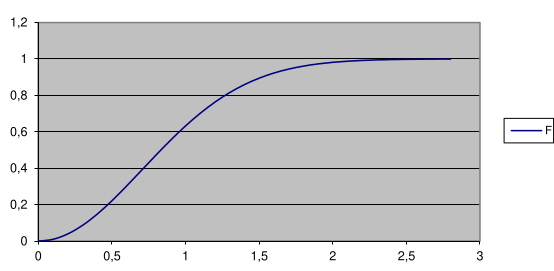

# 1. Index

- [1. Index](#1-index)
- [2. Random Variables](#2-random-variables)
  - [2.1. Example: throws of two dices](#21-example-throws-of-two-dices)
  - [2.2. Example: Electronic Devices](#22-example-electronic-devices)
  - [2.3. Cumulative Distribution Function](#23-cumulative-distribution-function)
    - [2.3.1. Example: Continuous RV](#231-example-continuous-rv)
  - [2.4. Probability Mass Function for Discrete RV](#24-probability-mass-function-for-discrete-rv)
    - [2.4.1. Example: PMF and CDF](#241-example-pmf-and-cdf)
  - [2.5. Probability Density Function for Continuous RV](#25-probability-density-function-for-continuous-rv)

# 2. Random Variables

There are several ways to define _random variables_.

We will define them as **real-valued functions**:

> Given a **random experiment** whose sample space is $S$, we say that $X$ is a
> **Random Variable** on $S$ if it is a **Real-Valued function** $X:S\to\R$.

Random variables are denoted with **uppercase letters**, and have _nothing
random in itself_.

## 2.1. Example: throws of two dices

Suppose we throw two dices, the sample space is:

$$
S = \Set{(d_1,d_2)\vert 1 \le d_1, d_2 \le 6}
$$

We can define the following random variables:

- $X$: **sum** of the values on each die: &emsp;$X:S\to \R, X((d_1, d_2))
= d_1 + d_2$
- $Y$: **maximum** value on either die: &emsp;$X:S\to \R, X((d_1, d_2)) = \max{(d_1,d_2)}$

$X$ takes on values $\Set{2, 3, ..., 11, 12}$, whereas $Y$ takes on values $\Set{1,2,...,6}$.

A **discrete** RV takes on a **discrete set of _Real_ values**, as in the
examples we will see.

A **continuous** RV takes on a **continuous set of values**. This are encountered
when talking about time or frequency.

## 2.2. Example: Electronic Devices

We buy two electronic devices, each one of which can be either functioning or
defective with some probability. The sample space for this random experiment
is the set of the following outcomes:

$$
  S=\Set{ (f,f), (f,d), (d,f), (d,d) }
$$

We have a probability for each outcome:

- $P(\Set{f, f}) = 0.49$
- $P(\Set{(f, d)}) = P(\Set{(f, f)}) = 0.21$
- $P(\Set{(d, d)}) = 0.09$

Given a random experiment, the definition of a random variable on that
experiment is in the mind of the observer, same as the definition of an outcome.

For instance, we can define the random variable $X$ "number of devices":

- $X(\Set{f, f}) = 2$
- $X(\Set{(f, d)}) = P(\Set{(f, f)}) = 1$
- $X(\Set{(d, d)}) = 0$

Hence, we have that:

$$
P\Set{X = 2} = 0.49, \quad P\Set{X = 1} = 0.42, \quad P\Set{X = 0} = 0.09
$$

## 2.3. Cumulative Distribution Function

A random variable $X$ is **completely characterized** by its **Cumulative
Distribution Function (CDF)**, which is defined as:

$$
F(\omega) = P(X \le \omega)
$$

Where omega is a **value**.

In the example of "number of functioning devices", we have that:

$$
F(0) = 0.09, \quad F(1) = 0.51, \quad F(2) = 1
$$

A CDF is **always _weakly monotonic increasing_**, **right continuous** function,
mapping to values in $[0, 1]$.
In particular, it is quite obvious that:

$$
\begin{matrix}
  \lim_{\omega \to -\infty} F(\omega) = 0 &
  \qquad &
  \lim_{\omega \to +\infty} F(\omega) = 1
\end{matrix}
$$

For a **discrete RV**, the CDF is a **staircase function**.

### 2.3.1. Example: Continuous RV

> Consider an RV $X$ whose $F(\omega)$ CDF is:
>
> $$
> F(\omega) = \begin{cases}
>   0 & \omega \le 0 \\
>   1 - e^{-\omega^2} & \omega > 0
> \end{cases}
> $$
>
> Compute $P\Set{X > 1}$.

The first step, as said by the professor, is to:

> **_DRAW THE BLOODY FUNCTION_**

In this case the plot is the following:

The request of the exercise is the complementary of the definition of the CDF, hence:

$$
\begin{align*}
  P\Set{X > 1} &= 1 - P\Set{X \le 1} \\
  &= 1 - F(1) \\
  &= 1 - (1 - e^{-1}) \\
  &= e^{-1}
\end{align*}
$$

Once we have the CDF of a RV, **we can answer any question about the
probability of the RV**.

For instance, we can calculate $P\Set{1 < X \le 2}$ as it follows:

$$
\begin{align*}
  P\Set{X\le 2} &= P\Set{X\le 1} + P\Set{1 < X\le 2} \\
  P\Set{1 < X\le 2} &= P\Set{X\le 2} - P\Set{X\le 1} \\
  &= F(2) - F(1) \\
  &= (1 - e^{-4}) - (1-e^{-1}) \\
  &= \frac{1}{e} - \frac{1}{e^4}
\end{align*}
$$

## 2.4. Probability Mass Function for Discrete RV

For **discrete RV** (and for these **only**), a **Probability Mass Function
(PMF)** can be defined as:

$$
  p(a) = P\Set{X = a}
$$

For a discrete RV, $p(a)$ can be _non-null_ only for a **numerable quantity of values**,
because of the **normalization condition**:

$$
\sum_{a} p(a) = 1
$$

Furthermore, the PMF is related to the CDF as follows:

$$
\begin{matrix}
  F(a) = \sum_{x \le a}{ p(x) } &
  \qquad &
  p(a) = F(a) - F(a^-)
\end{matrix}
$$

### 2.4.1. Example: PMF and CDF

> A discrete RV $X$ has 3 values: $1,2,3$. We know that:
>
> - $p(1) = \frac{1}{2}$
> - $p(2) = \frac{1}{3}$
>
> Draw the PMF and the CDF.

It is obvious that $p(3) = 1 - \frac{1}{2} - \frac{1}{3} = \frac{1}{6}$.

This means that the PMF has **three spikes** at $1, 2, 3$ with heights
$\frac{1}{2}, \frac{1}{3}, \frac{1}{6}$ respectively.

The CDF will be a staircase function with **jumps** at $1, 2, 3$ of heights
equal of the values of $p(1), p(2), p(3)$.

## 2.5. Probability Density Function for Continuous RV

For continuous RV <strong><u>it makes no sense to define a PMF</u></strong>,
as it is impossible that a RV takes on exactly a value in a continuous space.

The best we can do is to explore whether a RV is more or less likely to take
on a value in a certain interval than in another.

For continuous RV, we can define a **Probability Density Function (PDF)**
$f(x)$, which is a non negative function such that:

$$
P\Set{X\in B} = \int_{B}{f(x)\;dx}
$$

This definition uphold the **normalization condition**:

$$
  P\Set{X\in \R} = \int_{\R}{f(x)\;dx} = 1
$$

Moreover, if $B$ is an interval $[a, b]$, we have that:

$$
P\Set{a\le X\le B} = \int_{a}^{b}{f(x)\;dx} = F(b) - F(a)
$$

Note that with continuous RV, it does not matter whether the interval is open
or closed, as the probability:

$$
P\Set{a - \frac{\varepsilon}{2} < X < a + \frac{\varepsilon}{2}}
= \int_{a - \frac{\varepsilon}{2}}^{a + \frac{\varepsilon}{2}}{f(x)\;dx}
\approx \varepsilon \cdot f(a)
$$

This means that $f(a)$ is a measure of how likely it is that $X$ takes on
values **around $a$**.

If we looked for the probability that a RV is exactly equal to $a$, we would have:

$$
P\Set{X = a} = \int_{a}^{a}{f(x)\;dx} = F(a) - F(a) = 0
$$

The most important property of the PDF is that it is related to the CDF as follows:

$$
\Large
F(a) = P\Set{X \le a} = \int_{-\infty}^{a}{f(x)\;dx}
$$

Taking the other way around, we can differentiate the CDF (where possible)
to get the PDF:

$$
\Large
f(a) = \frac{\partial}{\partial a} F(a)
$$
