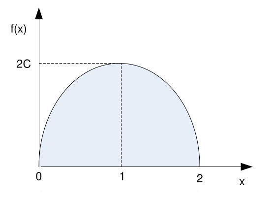
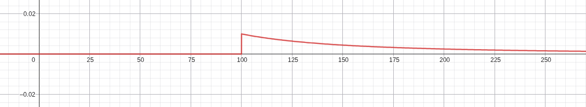
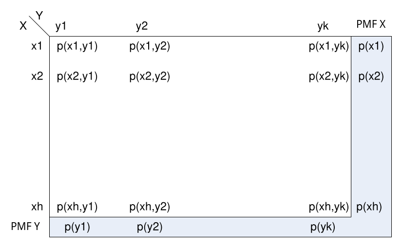
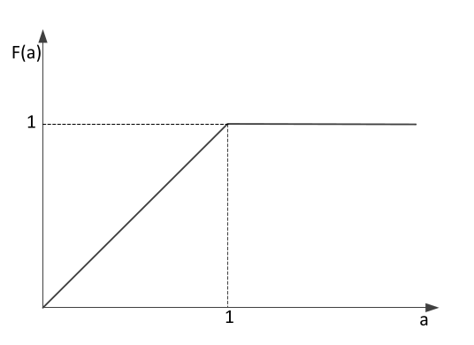
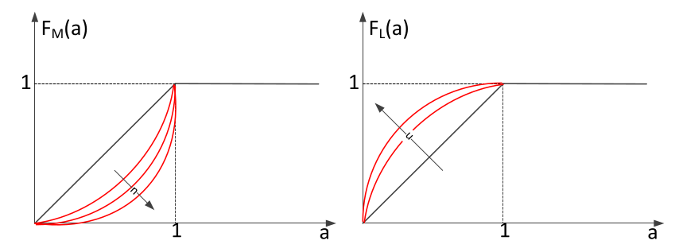

# 1. Index

- [1. Index](#1-index)
- [2. Random Variables](#2-random-variables)
  - [2.1. Example: throws of two dices](#21-example-throws-of-two-dices)
  - [2.2. Example: Electronic Devices](#22-example-electronic-devices)
  - [2.3. Cumulative Distribution Function](#23-cumulative-distribution-function)
    - [2.3.1. Example: Continuous RV](#231-example-continuous-rv)
  - [2.4. Probability Mass Function for Discrete RV](#24-probability-mass-function-for-discrete-rv)
    - [2.4.1. Example: PMF and CDF](#241-example-pmf-and-cdf)
  - [2.5. Probability Density Function for Continuous RV](#25-probability-density-function-for-continuous-rv)
    - [2.5.1. Example: PDF](#251-example-pdf)
    - [2.5.2. Example: Students ranking](#252-example-students-ranking)
    - [2.5.3. Example: Heads and Tails](#253-example-heads-and-tails)
    - [2.5.4. Example: Radio Tubes](#254-example-radio-tubes)
  - [2.6. Jointly Distributed Random Variables](#26-jointly-distributed-random-variables)
    - [2.6.1. Joint PMF fo Discrete RVs](#261-joint-pmf-fo-discrete-rvs)
    - [2.6.2. Joint PDF for Continuous RVs](#262-joint-pdf-for-continuous-rvs)
    - [2.6.3. Exercise: Joint PDF](#263-exercise-joint-pdf)
    - [2.6.4. Joint Distributions of $n$ Random Variables](#264-joint-distributions-of-n-random-variables)
  - [2.7. Independent Random Variables](#27-independent-random-variables)
    - [2.7.1. Exercise: Independent RVs](#271-exercise-independent-rvs)
    - [2.7.2. Exercise: Independent and Identically Distributed RVs](#272-exercise-independent-and-identically-distributed-rvs)

# 2. Random Variables

There are several ways to define _random variables_.

We will define them as **real-valued functions**:

> Given a **random experiment** whose sample space is $S$, we say that $X$ is a
> **Random Variable** on $S$ if it is a **Real-Valued function** $X:S\to\R$.

Random variables are denoted with **uppercase letters**, and have _nothing
random in itself_.

## 2.1. Example: throws of two dices

Suppose we throw two dices, the sample space is:

$$
S =\Set{(d_1,d_2)\vert 1\le d_1, d_2\le 6}
$$

We can define the following random variables:

- $X$: **sum** of the values on each die: &emsp;$X:S\to\R, X((d_1, d_2))
= d_1 + d_2$
- $Y$: **maximum** value on either die: &emsp;$X:S\to\R, X((d_1, d_2)) =\max{(d_1,d_2)}$

$X$ takes on values $\Set{2, 3, ..., 11, 12}$, whereas $Y$ takes on values $\Set{1,2,...,6}$.

A **discrete** RV takes on a **discrete set of _Real_ values**, as in the
examples we will see.

A **continuous** RV takes on a **continuous set of values**. This are encountered
when talking about time or frequency.

## 2.2. Example: Electronic Devices

We buy two electronic devices, each one of which can be either functioning or
defective with some probability. The sample space for this random experiment
is the set of the following outcomes:

$$
  S=\Set{ (f,f), (f,d), (d,f), (d,d) }
$$

We have a probability for each outcome:

- $P(\Set{f, f}) = 0.49$
- $P(\Set{(f, d)}) = P(\Set{(f, f)}) = 0.21$
- $P(\Set{(d, d)}) = 0.09$

Given a random experiment, the definition of a random variable on that
experiment is in the mind of the observer, same as the definition of an outcome.

For instance, we can define the random variable $X$ "number of devices":

- $X(\Set{f, f}) = 2$
- $X(\Set{(f, d)}) = P(\Set{(f, f)}) = 1$
- $X(\Set{(d, d)}) = 0$

Hence, we have that:

$$
P\Set{X = 2} = 0.49,\quad P\Set{X = 1} = 0.42,\quad P\Set{X = 0} = 0.09
$$

## 2.3. Cumulative Distribution Function

A random variable $X$ is **completely characterized** by its **Cumulative
Distribution Function (CDF)**, which is defined as:

$$
F(\omega) = P(X\le\omega)
$$

Where omega is a **value**.

In the example of "number of functioning devices", we have that:

$$
F(0) = 0.09,\quad F(1) = 0.51,\quad F(2) = 1
$$

A CDF is **always _weakly monotonic increasing_**, **right continuous** function,
mapping to values in $[0, 1]$.
In particular, it is quite obvious that:

$$
\begin{matrix}
 \lim_{\omega\to -\infty} F(\omega) = 0 &
 \qquad &
 \lim_{\omega\to +\infty} F(\omega) = 1
\end{matrix}
$$

For a **discrete RV**, the CDF is a **staircase function**.

### 2.3.1. Example: Continuous RV

> Consider an RV $X$ whose $F(\omega)$ CDF is:
>
> $$
> F(\omega) =\begin{cases}
>   0 &\omega\le 0\\
>   1 - e^{-\omega^2} &\omega > 0
> \end{cases}
> $$
>
> Compute $P\Set{X > 1}$.

The first step, as said by the professor, is to:

> **_DRAW THE BLOODY FUNCTION_**

In this case the plot is the following:

The request of the exercise is the complementary of the definition of the CDF, hence:

$$
\begin{align*}
  P\Set{X > 1} &= 1 - P\Set{X\le 1}\\
  &= 1 - F(1)\\
  &= 1 - (1 - e^{-1})\\
  &= e^{-1}
\end{align*}
$$

Once we have the CDF of a RV, **we can answer any question about the
probability of the RV**.

For instance, we can calculate $P\Set{1 < X\le 2}$ as it follows:

$$
\begin{align*}
  P\Set{X\le 2} &= P\Set{X\le 1} + P\Set{1 < X\le 2}\\
  P\Set{1 < X\le 2} &= P\Set{X\le 2} - P\Set{X\le 1}\\
  &= F(2) - F(1)\\
  &= (1 - e^{-4}) - (1-e^{-1})\\
  &=\frac{1}{e} -\frac{1}{e^4}
\end{align*}
$$

## 2.4. Probability Mass Function for Discrete RV

For **discrete RV** (and for these **only**), a **Probability Mass Function
(PMF)** can be defined as:

$$
  p(a) = P\Set{X = a}
$$

For a discrete RV, $p(a)$ can be _non-null_ only for a **numerable quantity of values**,
because of the **normalization condition**:

$$
\sum_{a} p(a) = 1
$$

Furthermore, the PMF is related to the CDF as follows:

$$
\begin{matrix}
  F(a) =\sum_{x\le a}{ p(x) } &
 \qquad &
  p(a) = F(a) - F(a^-)
\end{matrix}
$$

### 2.4.1. Example: PMF and CDF

> A discrete RV $X$ has 3 values: $1,2,3$. We know that:
>
> - $p(1) =\frac{1}{2}$
> - $p(2) =\frac{1}{3}$
>
> Draw the PMF and the CDF.

It is obvious that $p(3) = 1 -\frac{1}{2} -\frac{1}{3} =\frac{1}{6}$.

This means that the PMF has **three spikes** at $1, 2, 3$ with heights
$\frac{1}{2},\frac{1}{3},\frac{1}{6}$ respectively.

The CDF will be a staircase function with **jumps** at $1, 2, 3$ of heights
equal of the values of $p(1), p(2), p(3)$.

## 2.5. Probability Density Function for Continuous RV

For continuous RV <strong><u>it makes no sense to define a PMF</u></strong>,
as it is impossible that a RV takes on exactly a value in a continuous space.

The best we can do is to explore whether a RV is more or less likely to take
on a value in a certain interval than in another.

For continuous RV, we can define a **Probability Density Function (PDF)**
$f(x)$, which is a non negative function such that:

$$
P\Set{X\in B} =\int_{B}{f(x)\;dx}
$$

This definition uphold the **normalization condition**:

$$
  P\Set{X\in\R} =\int_{\R}{f(x)\;dx} = 1
$$

Moreover, if $B$ is an interval $[a, b]$, we have that:

$$
P\Set{a\le X\le B} =\int_{a}^{b}{f(x)\;dx} = F(b) - F(a)
$$

Note that with continuous RV, it does not matter whether the interval is open
or closed, as the probability:

$$
P\Set{a -\frac{\varepsilon}{2} < X < a +\frac{\varepsilon}{2}}
=\int_{a -\frac{\varepsilon}{2}}^{a +\frac{\varepsilon}{2}}{f(x)\;dx}
\approx\varepsilon\cdot f(a)
$$

This means that $f(a)$ is a measure of how likely it is that $X$ takes on
values **around $a$**.

If we looked for the probability that a RV is exactly equal to $a$, we would have:

$$
P\Set{X = a} =\int_{a}^{a}{f(x)\;dx} = F(a) - F(a) = 0
$$

The most important property of the PDF is that it is related to the CDF as follows:

$$
\Large
F(a) = P\Set{X\le a} =\int_{-\infty}^{a}{f(x)\;dx}
$$

Taking the other way around, we can differentiate the CDF (where possible)
to get the PDF:

$$
\Large
f(a) =\frac{\partial}{\partial a} F(a)
$$

### 2.5.1. Example: PDF

> Consider the following PDF:
>
> $$
> f(x) =\begin{cases}
>   C\cdot (4x - 2x^2) & 0\le x\le 2\\
>   0 &\text{otherwise}
> \end{cases}
> $$

The first step is to draw the function:

The image tells us that:

1. The area under the curve in finite, so it will exist a $C$ that normalizes the
   function.
2. The function is an inverted parabola symmetric to $1$, so $P\Set{X > 1}$
   will be exactly $\frac{1}{2}$.

To compute $C$ we just:

$$
\begin{align*}
  1 &=\int_{-\infty}^{+\infty}{f(x)\;dx}\\
  &=\int_{0}^{2}{C\cdot (4x - 2x^2)\;dx}\\
  &= C\cdot\left[ 2x^2 -\frac{2}{3}x^3\right]_{0}^{2}\\
  &= C\cdot\left( 8 -\frac{16}{3}\right) = C\cdot\frac{8}{3}\\
  C &=\frac{3}{8}
\end{align*}
$$

### 2.5.2. Example: Students ranking

> Five male and five female students are ranked according to their grades. Assume
> each ranking to be equally likely, an no ex-aequo position. Let $X$ be a RV defined
> as _the **highest** position occupied by a female student_. Compute the PMF
> of $X$.

$X$ is a **discrete RV** and we need to compute $p(j) = P\Set{X = j}$ for $1
\le j\le 10$.

The support for this function will be just $1\le j\le 6$, since there are 5 female.

Starting with $p(1)$, intuition tells us that the overall probability should
be $0.5$ since positioning is _equally likely_.
We still need to compute calculations, using UPM:

$$
\begin{align*}
  p(1)  &= \frac{\text{\# outcomes with a female in position 1}}{\text{\# total outcomes}}  \\
        &= \frac{5\cdot 9!}{10!}  \\
        &= \frac{5}{10} =\frac{1}{2}
\end{align*}
$$

In the same way we can compute $p(2)$ supposing we have the sequence `MFXX...X`:

$$
\begin{align*}
  p(1) &=\frac{\text{\# outcomes with a male in position 1}\cdot
 \text{\# outcomes with a female in position 2}}{\text{\# total
outcomes}}\\
  &=\frac{5\cdot 5\cdot 8!}{10!}\\
  &=\frac{25}{10\cdot 9} =\frac{5}{18}
\end{align*}
$$

This can be easily understood generalizing for $j$, supposing that if the top
position is the $j$-th, the sequence will be $M_1...M_{j-1}F_{j}X...X$:

$$
\begin{CD}
{1\le j\le 6} @>>>
\begin{aligned}
  p(j) &=\frac{5\cdot (10-j)!}{10!}\cdot\frac{5!}{(5-(j-1))!}\\
       &=\frac{5\cdot (10-j)!}{10!}\cdot S_{j-1,5}
\end{aligned}
\end{CD}
$$

### 2.5.3. Example: Heads and Tails

> Let $X$ be the difference $\text{\# heads} -\text{\# tails}$ when you flip a coin
> $n$ times, in independent conditions.
>
> 1. Support of $X$ (values of $X$)
> 2. Compute the PMF of $X$ when $n = 3$

For the first point we can try some values for $n$:

- $n = 1$ &emsp; $\to$ &emsp; $+1, -1$ ($H$, $T$)
- $n = 2$ &emsp; $\to$ &emsp; $+2, 0, -2$ ($HH$, $HT$, $TT$)
- $n = 3$ &emsp; $\to$ &emsp; $+3, +1, -1, -3$ ($HHH$, $HHT$, $TTH$, $TTT$)

Generalizing, we can see a pattern that goes down from $n$ to $-n$ in steps of $2$:

$$
  S =\Set{ n - 2j,\; 0\le j\le n}
$$

For the second point, assuming a _fair coin_, values with the same modulus
**must have the same value**, therefore we can study just the positive outcomes.

The value $+3$ is obtained with the outcome $HHH$, which has a probability of
$\frac{1}{8}$.

Since the probability of $+3$ and $+1$ must sum to $\frac{1}{2}$, we can
compute $p(+1)$ simply as $\frac{1}{2} -\frac{1}{8} =\frac{3}{8}$.

### 2.5.4. Example: Radio Tubes

> A radio uses 5 radio tubes. The lifetime of each tube is a continuous RV
> whose PDF is:
>
> $$
> f(x) =\begin{cases}
>   0 & x\le 100\\
>  \frac{100}{x^2} & x > 100
> \end{cases}
> $$
>
> Compute the probability that _exactly_ 2 tubes out of 5 should be replaced within
> 150 hours of operation. Assume the lifetimes of the tubes are independent.

The first step is to draw the function:

Since it pays to be skeptical, we check if the function is normalized:

$$
\begin{align*}
  P{X\in (-\infty, +\infty)} &=\int_{-\infty}^{+\infty}{f(x)\;dx}\\
  &=\int_{100}^{+\infty}{\frac{100}{x^2}\;dx}\\
  &=\left[ -\frac{100}{x}\right]_{100}^{+\infty}\\
  &= 0 - (-1) = 1
\end{align*}
$$

Now, the probability that _one tube_ breaks within the first 150 hours is:

$$
\begin{align*}
  P\Set{X\le 150} &=\int_{100}^{150}{\frac{100}{x^2}\;dx}\\
  &=\left[ -\frac{100}{x}\right]_{100}^{150}\\
  &= -\frac{100}{150} + 1 =\frac{1}{3} = p
\end{align*}
$$

For the event "exactly 2 out of 5 are to be replaced" we can do
_multiplication_ using binomial coefficients since the probability are independent:

$$
  P = \binom{5}{2}p^2\cdot (1 - p)^3 = 10\cdot\frac{1}{9}\cdot {8}{27} =
\frac{80}{243} \approx \frac{1}{3}
$$

## 2.6. Jointly Distributed Random Variables

We are often interested in the _joint_ distribution of two RV $X$ and $Y$.

In these cases, knowing the CDF of each RV gives us no information about the outcome
of the two conjoined.

At the same time, we might be interested to know whether there is any **correlation**
between the two RVs.

Given two RVs (either discrete or continuous) $X$ and $Y$, we can define their
**Joint Cumulative Distribution Function (JCDF)** as:

$$
  F(x, y) = P\Set{X\le x, Y\le y}
$$

Where the comma denotes a _logical AND_.

From the joined CDF we can derive the CDF of the single variable $X$ as follows:

$$
F_X(x) = P\Set{X\le x} = P\Set{X\le x, Y\le +\infty} = F(x, +\infty)
$$

### 2.6.1. Joint PMF fo Discrete RVs

The JCDF exists for both discrete and continuous RVs.
For _discrete RV_, we can define a **Joint Probability Mass Function (JPMF)** as:

$$
  p(x,y) = P\Set{X = x, Y = y}
$$

In this case too we can get the PMF os the single RV $X$ as follows:

$$
\begin{align*}
  P\Set{X = x} &= P\Set{\cup_i{X = x, Y = y_i}} \\
  &= \sum_i{P\Set{X = x, Y = y_i}} \\
  &= \sum_i{p(x, y_i)}
\end{align*}
$$

Furthermore, the JCDF can be obtained from the JPMF as follows:

$$
  F(x,y) = P\Set{X\le x, Y\le y} = \sum_{x_i\le x}\sum_{y_i\le y}{p(x_i, y_i)}
$$

The probabilities $P\Set{X = x}$ and $P\Set{Y = y}$ are often called **marginal
probabilities**. This happens because the JPMF is often given in a **table form**:

### 2.6.2. Joint PDF for Continuous RVs

For two continuous RVs $X$ and $Y$, if for every set $C$ of pairs of real number
$(x,y)$, we have:

$$
    P\Set{(X, Y)\in C} =\iint_{(x,y)\in C}{f(x,y)\;dxdy}
$$

Where $f(x,y)$ is called **Joint Probability Density Function (JPDF)**, of $X$ and
$Y$.

More specifically, when $C$ can be separated into two sets of real numbers
$ C = \Set{(x,y)\vert x\in A, y\in B}$, we can rewrite the previous equation as:

$$
\begin{align*}
  P\Set{(X,Y \in C)} &= P\Set{X\in A, Y\in B} \\
  P &=\int_{A}{\left[\int_{B}{f(x,y)\;dy}\right]\;dx}
\end{align*}
$$

From the definition, we obtain the following relation:

$$
\begin{align*}
  F(a, b) &= P\Set{X\le a, Y\le b} \\
  &= P\Set{X \in (-\infty, a], Y \in (-\infty, b]} \\
  &= \int_{-\infty}^{a}{\int_{-\infty}^{b}{f(x,y)\;dy}\;dx}
\end{align*}
$$

Hence, the JCDF can be obtained from the JPDF by integration. Furthermore, the
JPDF can be obtained from the JCDF by differentiation:

$$
  f(a,b) = \frac{\partial^2}{\partial a\partial b} F(a,b)
$$

If the JPDF exists, then also the single PDFs of $X$ and $Y$ exists as well, and
they can be computed quite easily:

$$
\begin{align*}
  P\Set{X\in A} = P\Set{X\in A, Y\in (-\infty, +\infty)} \\
  \int_{A}{\int_{-\infty}^{+\infty}{f(x,y)\;dy}\;dx}
\end{align*}
$$

But we also know that that $P\Set{X\in A} = \int_{A}{f_X(x)\;dx}$, hence we can
conclude that:

$$
  f_X(x) = \int_{-\infty}^{+\infty}{f(x,y)\;dy}
$$

### 2.6.3. Exercise: Joint PDF

> The JDF of two variables $X$ and $Y$ is:
>
> $$
>   f(x,y) = \begin{cases}
>     2e^{-x}e^{-2y} & x,y > 0 \\
>     0 & \text{otherwise}
>   \end{cases}
> $$
>
> Compute:
> a) $P\Set{X > 1, Y < 1}$
> b) $P\Set{X < Y}$
> c) $P\Set{X < a}$

In this case, we can't easily draw the function, but we can still compute probabilities.

For the first point:

$$
\begin{align*}
  P{X > 1, Y < 1} &=
  \int_{0}^{1}{\left[\int_{1}^{+\infty}{2e^{-x}e^{-2y}\;dx}\right]\;dx} \\
  &= \int_{0}^{1}{\left[2e^{-2y}\int_{1}^{+\infty}{e^{-x}\;dx}\right]\;dy} \\
  &= \int_{0}^{1}{\left[2e^{-2y}e^{-1}\right]\;dy} \\
  &= 2e^{-1}\int_{0}^{1}{e^{-2y}\;dy} \\
  &= 2e^{-1}\left[-\frac{1}{2}e^{-2y}\right]_{0}^{1} \\
  &= 2e^{-1}\left[-\frac{1}{2}e^{-2} + \frac{1}{2}\right] \\
  &= e^{-1}\left[1 - e^{-2}\right] = \frac{1 - e^{-2}}{e}
\end{align*}
$$

For the second point, we can first use intuition. We know that the function
decreases exponentially in both directions, but it decreases faster in the $y$.
Therefore, given two values $x,y$, taken at random, it is _more likely_ that
$x > y$ rather than the opposite.

Hence, we expect $P\Set{X < Y} < \frac{1}{2}$.

Let's compute the probability, knowing that $x$ goes from $0$ to $y$ at all times:

$$
\begin{align*}
  P\Set{X < Y} &=
  \int_{0}^{+\infty}{\left[\int_{0}^{y}{2e^{-x}e^{-2y}\;dx}\right]\;dy} \\
  &\vdots \\
  &= \frac{1}{3}
\end{align*}
$$

Using again the same procedure:

$$
\begin{align*}
  P\Set{X < a} &=
    \int_{0}^{a}{\left[\int_{0}^{+\infty}{2e^{-x}e^{-2y}\;dy}\right]\;dx} \\
  &\vdots \\
  &= 1 - e^{-a} = \frac{e^a - 1}{e^a}
\end{align*}
$$

### 2.6.4. Joint Distributions of $n$ Random Variables

The definition given above, can be extended to the case of $n$ RV $X_1, X_2, ..., X_n$:

$$
  F(x_1, x_2, ..., x_n) = P\Set{X_1\le x_1, X_2\le x_2, ..., X_n\le x_n}
$$

We can obtain the CDF for the single RV $X_i$ as:

$$
  F_{x_i}(x_i) = F(+\infty, ..., +\infty, x_i, +\infty, ..., +\infty)
$$

## 2.7. Independent Random Variables

Two RVs $X$ and $Y$ are **independent if and only if**:

$$
  F(x,y) = F_X(x)F_Y(y)
$$

This is equivalent to say that $\Set{X\le x}$ and $\S\Set{Y\le y}$ are
_independent events_ for every possible value $x$ and $y$.

In fact, considering:

$$
\begin{align*}
  F(x,y) &= P\Set{X\le x, Y\le y} \\
  &= P\Set{X\le x \vert Y\le y} \cdot P\Set{Y\le y}
\end{align*}
$$

If the two sets are independent events, then we have simply that:

$$
  F(x,y) = P\Set{X\le x} \cdot P\Set{Y\le y} = F_X(x)F_Y(y)
$$

If they are independent, it follows that:

- **Discrete**: $p(x,y) = p_X(x)p_Y(y)$ (JPMF is the product of the single PMFs)
- **Continuous**: $f(x,y) = f_X(x)f_Y(y)$ (JPDF is the product of the single PDFs)

This obviously generalizes to $n$ RDVs, where they are independent **if and
only if**:

$$
  \large
  F(x_1, x_2, ..., x_n) = \prod_{i=1}^{n}{F_{X_i}(x_i)}
$$

### 2.7.1. Exercise: Independent RVs

> Let $X$ and $Y$ be two **independent** RVs both with the following PDF:
>
> $$
>   f(x) = \begin{cases}
>     e^{-x} & x > 0 \\
>     0 & \text{otherwise}
>   \end{cases}
> $$
>
> Compute the PDF of $Z = \frac{X}{Y}$

Since $X \in [0, +\infty)$ and $Y \in [0, +\infty)$, we have that $Z \in [0, +\infty)$.

Since working with PDF is difficult, we can first find the CDF of $Z$:
$P\Set{Z \le k}$

We can find the JCDF of $X$ and $Y$ simply multiplying (since they are independent):

$$
  f(x,y) = f_X(x)f_Y(y) = e^{-x}e^{-y} = e^{-(x+y)}
$$

Since we want $Z < k$, it means that we can write the probability as:

$$
\begin{align*}
  P\Set{Z \le k} &= P\Set{\frac{X}{Y} \le k} \\
  &= P\Set{Y \ge \frac{X}{z}} = P\Set{X \le Yk} \\
  F_Z(k) &= \int_{0}^{+\infty}{\left[\int_{0}^{yk}{e^{-(x+y)}\;dx}\right]\;dy} \\
  &\vdots \\
  &= 1 - \frac{1}{1 + k} = \frac{k}{1 + k}
\end{align*}
$$

We can easily check that it verifies $F(-\infty)\to F(0) = 0$, $F(+\infty) = 1$
and that is an increasing function.

Since this function is **continuous and differentiable**, we can differentiate
it to get the PDF of $Z$:

$$
  f_Z(k) = \frac{\partial}{\partial k} F_Z(k) = \frac{1}{(1 + k)^2}
$$

### 2.7.2. Exercise: Independent and Identically Distributed RVs

> Given $n$ RVs $X_1, X_2, ..., X_n$ that are **independent and identically
> distributed (iid)**, whose CFDs are $F(a)$, compute the CDF of the following RVs:
>
> a) $M = \max\Set{X_1, X_2, ..., X_n}$
> b) $L = \min\Set{X_1, X_2, ..., X_n}$

Since the RVs are independent, we can write the JCDF:

$$
  F(x_1, x_2, ..., x_n) = \prod_{i=1}^{n}{F(x_i)}
$$

For the RV $M$, we can observe that, since they are independent and identically
distributed:

$$
\begin{align*}
  F_M(a) &= P\Set{M \le a} \\
  &= P\Set{\max\Set{X_1, X_2, ..., X_n} \le a} \\
  &= P\Set{X_1 \le a, X_2 \le a, ..., X_n \le a} \\
  &= P\Set{X_1 \le a} \cdot P\Set{X_2 \le a} \cdots P\Set{X_n \le a} \\
  &= \prod_{i=1}^{n}{P\Set{X_i \le a}} \\
  &= \prod_{i=1}^{n}{F(a)} \\
  &= [F(a)]^n
\end{align*}
$$

For the _minimum_ $L$, the reasoning is similar, but we use the complement of
the event:

$$
\begin{align*}
  1 - F_L(a) &= P\Set{L > a} \\
  &= P\Set{\min\Set{X_1, X_2, ..., X_n} \le a} \\
  &= 1 - P\Set{\min\Set{X_1, X_2, ..., X_n} > a} \\
  &= 1 - P\Set{X_1 > a, X_2 > a, ..., X_n > a} \\
  &= 1 - P\Set{X_1 > a} \cdot P\Set{X_2 > a} \cdots P\Set{X_n > a} \\
  &= 1 - \prod_{i=1}^{n}{P\Set{X_i > a}} \\
  &= 1 - \prod_{i=1}^{n}{(1 - F(a))} \\
  &= 1 - [1 - F(a)]^n
\end{align*}
$$

From this we obtain:

$$
  F_L(a) = 1 - [1 - F(a)]^n
$$

Looking at the result we can search for a _physical explanation_.

Let's assume that $F(a)$ is the following:

$$
F(a) = \begin{cases}
  a & 0\le a < 1 \\
  1 & a \ge 1 \\
  0 & a < 0
\end{cases}
$$

Then it is easy to see that:

$$
\begin{matrix}
  F_M(a) = \begin{cases}
    a^n & 0\le a < 1 \\
    1 & a \ge 1
\end{cases} &
  \qquad &
  F_L(a) = \begin{cases}
    1 - (1 - a)^n & 0\le a < 1 \\
    1 & a \ge 1
  \end{cases}
\end{matrix}
$$

As $n$ grows larger, the distributions tend to a **step function**,
respectively in $1$ (maximum) and in $0$ (minimum). This is because, as the
number of samples grows, there is an increasing probability that:

- The **highest** sample will be $1$
- The **lowest** sample will be $0$

We can observe the same phenomenon with **discrete RVs**, like when throwing a dice.

The probability that we get a $6$ out of 1 throw is $\frac{1}{6}$, but if we throw
the dice $1000$ times, the probability that the _maximum_ value we got is $6$
is almost
equal to $1$.

The interesting thing is that this phenomenon is **independent of the
distribution** of the RVs, as long as there exists **two finite values** $a_L$
and $a_M$ such that $F(a_L) = 0$ and $F(a_M) = 1$.
