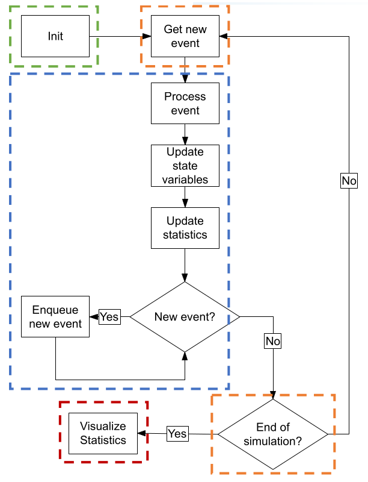

# 1. Index

- [1. Index](#1-index)
- [2. Systems](#2-systems)
  - [2.1. Performance Evaluations](#21-performance-evaluations)
- [3. Simulations](#3-simulations)
  - [3.1. Types of Simulations Model](#31-types-of-simulations-model)
  - [3.2. How to build a Good Simulator](#32-how-to-build-a-good-simulator)

# 2. Systems

A **system** is the subject of our performance evaluations, and is defined as:

> A _collection of entities_ that act and interact together towards the
> accomplishment of some logical goal

The collection of entities that describes the system depends on the objective
of the evaluations. The same system might be analyzed based on different
entities in different cases.

The description of a system is given by its **State**, that might change over time.
Depending on how the state variable of system change, we define the system as:

- **Continuous System**: if the change are continuous over time
- **Discrete System**: if the change happen instantaneously at a given time

## 2.1. Performance Evaluations

When we do a performance evaluation of a system, we **monitor** its state over time.
This way we can understand how it _evolves over time_, trace its _statistics_,
or computing some _limit values_.

This can be done essentially in three ways:

1. **Measurements**: we can simply let the _real system_ (or a prototype) work and
   measure the output. The problem with this technique is that sometimes we do
   not have access to the system we want to analyze nor he are able to create
   prototype of it.
2. **Analytical Models**: We can set up an _analytical model of the
   system_ (i.e. _equations_) that binds the desired quantities. The problem with
   this technique is that it might be difficult to find these relations, and even
   more difficult to actually solve them. We can always simplify the sets of equations,
   abstracting and leaving only "important stuff", but identifying the things that
   are "important" is not always possible prior of starting.
3. **Simulations Models**: We can set up a _software replica_ of the system, giving
   it some input and recording the output it produces. This way we can replicate
   only the parts of the system that are meaningful to our analysis. The problem
   with this technique is often the prices of the resources needed to run the simulations.

Putting all together, ideally, we can build a simulation model of the system
and validate it by comparing its result with a analytical model in a
simple basic scenario. After a complete simulation study, we can start building
a prototype of the real system.

# 3. Simulations

Simulations means _**mimicking a system on a computer**_.

In order to do so we need a specific software, called _simulation software_ or _simulator_,
which goals are:

- Understanding the functioning of the system
- Predicting the behavior of the system
- Support decisions on the system
- Training on a system
- Entertaining

In order to classify a simulation model as a _good simulation model_, its
output must be sufficiently close to reality.

Therefore, our aim is to tweak the system to make the approximated output
similar to the real output (or at least statistically equivalent).

Provided we are able to obtain a good model, almost everything can be simulated.
The presence of a model can allow us to evaluate alternatives, for example
what happens if the link between the endpoints of a communication is an
Ethernet cable or a fiber optic cable, or the "experimental settings", allowing
to change everything the system interacts with, which is very hard in the real world.
Other things we are able to do are the evaluation the scalability assessment, measuring
what happens when we multiply the input (e.g., a number of users) by a factor $k$,
or the manipulation of timescales, simulating the evolution of the universe in
a few seconds/minutes, or observe how the instructions of a computer program
are fetched and executed by a processor, which will typically take times in
the order of nanoseconds.

One of the downsides of using simulated models is the presence of _stochastic quantities_:
assuming you are simulating the arrival of packets at a router, the length of
these packets and their inter-arrival times will often be generated randomly,
maybe following some probability distributions.
This means that the node throughput is itself a random variable. This means that
each measure obtained from the simulator will be a _sample of an output random
variable_, and should be treated as such.

Another downside of building simulator is the building itself. Writing down a
simulator can be very difficult.
Furthermore, simulation analysis (not writing down the code, but using that
code) requires a lot of time, and (mostly) a lot of experience.

It is difficult to realize that a simulator is nothing more than a replica of
a model of a system, and not of the system itself. This means that we are
simplifying things. Taking the wrong modeling steps in the modeling part, can
disrupt the entire work.

## 3.1. Types of Simulations Model

Simulations means different things to different people:

1. **Static vs. Dynamic**: in _static models_ the output is time-invariant and
   can be obtained as $y = f(x)$, where $f$ is the model, and $x$ the input. In
   _Dynamic models_ we are interested in observing how the model changes over
   time, adding the difficulty of replicating something that is supposed to
   happen as time progresses.
2. **Continuous vs. Discrete**: This depends on what we want to evaluate and how
   we want to do it.
3. **Deterministic vs. Stochastic**: in _deterministic models_ we do not have
   random components present. On the contrary, in _stochastic models_ random
   components will produce a set of random output from a given input.

We will work mainly with _**Discrete Event Simulators**_ (`DES`), which are
_dynamic_, _discrete_ and _stochastic_.

## 3.2. How to build a Good Simulator

The first step of building a good simulator is **identifying the state variables**.
Among these variables, since we are working with _discrete-event simulations_,
we must have a special variable that will be responsible to simulate the
flowing of time, called the **simulation clock**.

The whole simulation will then be running in **simulated time**, defined as:

> The time as measured **within** the simulation.

Simulated time (_st_) **is not** real time (_rt_), otherwise we would be
talking about _emulation_.
In order to simulate one second of _st_ we might need either more or less than
one second of _rt_.

In general, there is **no constant relationship** between the _rt-flow_ and the
_st-flow_.

To make time evolve in a simulator, we use the _simulation clock_.
In order to advance the _simulation clock_ we can follow different approaches:

1. **Next-event time advance (event-based)**: Simulated time advances only
   when an _event_ is processed. Supposing the event processes an event at time
   $t_1$. Processing the event itself implies _generating another event_ at time
   $t_2$. The system clock advances only based on the event sequence,
   therefore it is clear that _rt-duration_ of one second of _st-time_ varies
   depending on how many events are in that second.
2. **Fixed-increment time advance (quantum-based)**: the system clock advances by
   a _fixed quantum_ called $D$. At time $kD$, we process all the events that occurred
   between $(k-1)D$ and $kD$. This implies:
   - _Possible time waste_: if the granularity of events $\gg D$, we waste a
     lot of _real time_ just to advance the clock when nothing happens.
   - _Possible simultaneous processing_: if the granularity is $\ll D$, different
     events happening in the same _simulated time-slot_, will be processed at
     the same time. This allows us to use _discrete variable_ as temporal quantum.

Quantum-based simulations make sense if the system is **intrinsically time-discrete**.
Moreover, fixed-increments can be recreated by using _fake periodical events_
in \_event-based simulations.

For these reasons we will assume that our `DES` will use the **Next-Time
Advance Mechanism**.

## Event Queue

An event is represented by a **Data Structure** that contains the following information:

- **Firing Time**: the time at which the event is scheduled to occur
- **Event Type**: the type of event (e.g., arrival, departure, etc.)
- **Other Data**: priority (needed in case of simultaneous events) and any additional
  information needed to process the event (e.g., customer ID, packet size, etc.)

Any discrete event simulator must maintain an **Event Queue**, which is a
priority queue that stores all the scheduled events in the **most efficient
possible way**.
The operation that **must** be supported by the event queue are:

1. Extraction of the _nearest future event_
2. Ordered insertion of a future event
3. Deletion of a future event

Event handling is a critical issue for system performance. Depending on ho efficiently
we perform the (de)queueing of events the RT that it takes for a simulation to
run can easily change by orders of magnitude.

## Components of a Simulator

Since the purpose of simulating a system is to evaluate its performance, we
need to **collect statistics** about the system.

These are called **Statistical Counters**, and can be scalar values, time
series, histograms, ...

These counters, as state variables, the simulation clock and the event queue,
are part of the Data Structures of the simulator.

On top of them, a simulator must provide a set of **Functions** that allow the
user to:

- **Initialize** the simulation, assigning initial values to the state
  variables, the simulation clock and the event queue.
- **Event Scheduler**: Determine the next event to be processed, and update
  the simulation clock accordingly.
- **Event Handler**: Process the event, updating the state variables and
  statistical counters as needed. It may insert new events into the event queue,
  or remove events from it.
- **Statistics Computation and Visualization**: Computes the final values of
  the statistics, producing them as output of the simulation.

The `init` function is a _special event handler_ that is called at the
beginning of the simulation, and is responsible to jump-start the whole simulation.

The activity of a simulation is a continuous cycle, as described in the figure
on the right.

We need to make a distinction between **General Purpose Simulators** and
**Ad-Hoc Simulators**:

General Purpose Simulators

They provide a set of generic functions for the _event queue_, _event
scheduler_, _event handler_, and _statistics computation_.

This is good for most of the systems we may want to model, as it allows us
to focus on the _modeling_ part, and not on the _implementation_ part.

Ad-Hoc Simulators

In very specific cases we might want to exploit some characteristics of
the system we are simulating. In these cases implementing a custom simulator,
with custom event queue, event scheduler, event handler, and statistics
computation might be more efficient.

In this course we will explore `OMNeT++`, a general purpose simulator that
provides us with a _general purpose simulation engine_ and a _graphical user
interface_, letting us only the duty of building only the **simulation model**.

### Example: Router Simulation

> Suppose we want to simulate a router, which receives and sends packets.
>
> Our goal is to know the **average delay** of packets in the queue

To model the system we could make incredible difficult structures, or simply
assume the router as a _simple queue_ of length $N$, connected to a _server_.

The first step is then to make some more assumptions about the systems:

- _Packet length_: we assume it constant and equal to $L$
- _Link Bandwidth_: we assume it constant and equal to $C$
- _Queue Length_: we assume it contains at most $N$ packets
- _Processing Time of Scheduler_: we assume it null
- _Inter-arrival Time_: we assume it as a _Random Variable_ $X\sim
Exp(\lambda)\to E[X] = \frac{1}{\lambda}$.

We can either solve this system analytically or **simulate it**.

The first step for building a simulator is to identify the **state variables**
of the system:

- **Simulation Clock**: `t = 0`
- **State Variables**:
  - _Packets in Queue_: `q = 0`
  - _Busy Status_: `busy = false`
- **Statistical Counters**:
  - _Packets Served_: `served = 0`
  - _Sum of Delays_: `delay_sum = 0`
  - _Number of Dropped Packets_: `drop = 0`
- **Configuration Parameters** (they have to be read either from configuration
  file or CLI):
  - _Packet Length_: `L`
  - _Link Bandwidth_: `C`
  - _Queue Length_: `N`
  - _Inter-arrival Time parameter_: $\lambda$

At this point we need to identify the (relevant) **events** that can happen in
the system:

1. The arrival of a packet at the router
2. The start of a transmission of a packet, the server is busy.
3. The _end_ of a transmission of a packet, the server is again available.
4. (Implicit) The Simulation End.

Let's suppose three events that can happen in the system:

1. At time $t_0$ a packet `j` arrives at the router. The simulation can evolve
   in three ways:
   - _No packets in queue_: The packet goes under service
   - $1..N-1$ _packets in the queue_: The packet is queued
   - $N$ packets in the queue: The packet is dropped
     The natural evolution for each of these cases is to schedule the next event,
     which is the arrival of packet `j+1` at time $t_0 + X$.

2. At time $t_1$ a packet `j` goes under service. In this case the next event
   will be for packet `j` to _leave the server_ at time $t_1 + \frac{L}{C}$.
3. At time $t_2$ a packet `j` leaves the server. The simulation can evolve in
   two ways:
   - _No packets in queue_: The server is now idle, the clock advances to the
     next event.
   - $1..N-1$ _packets in the queue_: At time $t_2$ the packet `j+1` goes under
     service.

For a system like this, the most efficient way to implement the _event queue_ would
probably be to devise an ad-hoc data structure. For instance, if $\frac{L}{C}
\;\ll\; E[X]$,
the _departure events_ will be much more frequent, making it very likely for:

- Type 1 events to be **tail insertions**
- Type 2/3 events to be **head insertions**

This knowledge can be exploited to implement a more efficient event queue, although
we have to be careful not to **optimize too much**, as the more optimized for
a use-case a simulator is, the less flexible it becomes.

At the end of the simulation, we will have obtained the _number of packets transmitted_
and the _sum of delays_, which will allow us to easily compute the **average delay**.

If we wanted to measure the _variance_ as well, the statistical counter we
have are not enough. Hence we would have to add a new statistical counter,
like a _vector_, which would need to keep all the delays values (eventually
removing the redundant `delay_sum`), and **re-run the whole simulation**.

## Implementing the Event Queue

A discrete event simulator spends a lot if time handling the _event queue_, since
the steps involved in a simulation are:

1. Get the next event from the queue
2. Execute the event
3. Add new event
4. Go back to step 1

Efficiency of the event queue is therefore critical for the performance of the whole
simulation. This, we need to optimize common operations in the queue:
**extraction of the next event**, **insertion of a new event**, and **deletion
of an event**.

Commonly employed data structures for the event queue are:

- **Min-Heap Tree**
- **Calendar Queue**

### Min-Heap Tree

It's a _binary tree_ (with $N$ nodes) where:

- The value of a parent node is **less than or equal** to the value of each of
  its children.
- Each level is filled _from left to right_. Level $n+1$ cannot be populated
  unless level $n$ is completely fill. Thus, its depth is approximately $\log_2(N)$,

The basic observation is that we do not need to keep _all events sorted_, but
we only need to be able to find the **next in time** quickly.
Using the **event firing time** as a sorting key, the root of the tree
represents the next event to be executed.

To implement a **Min-Heap** we can use a `last_index` variable and a simple
array where for any node `j`:

- The children is at position `2j+1` and `2j+2`
- The parent is at position `floor((j-1)/2)`

Using an array will keep all the nodes **contiguous in memory**, which is good
for cache performance.

The nearest future event is the one in the **root node**, which extraction is $O(1)$.

After the extraction, we need to **re-heapify** the tree. To do so, we can
take the _last node_ and put it as the new root. Then, if the root is grater
than at least one of its children, we swap it with the minimum between the two
children. We can then recursively delve in the tree and do the same with each
sub-tree. This whole operation is $O(\log_2(N)$.

Overall, is faster than using a _linked list_ or a _sorted array_.

For the insertion the procedure is similar. We insert the new node at the _last
position_, and then proceed to _bubble it up_ the tree, swapping it with its
parent if it is smaller, with a complexity of $O(\log_2(N))$.

The deletion of a node is similar to the extraction of the root in terms of
_re-heapification_, with the consideration is that locating the event takes $O(N)$.

This means that in models with frequent event deletions might not be suitable
to implement the _event queue_ with a Min-Heap.

### Calendar Queue

Is a data structure that keeps track of $M$ **buckets**, each of which is a
_sorted list_ of events.
